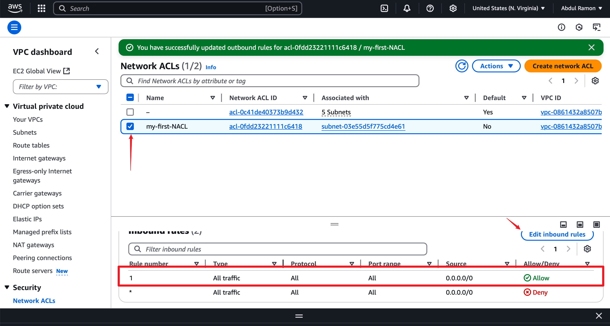

## Security-and-NACL
### 1. Project Overview
This project explores the configuration and implications of Security Groups and Network Access Control Lists (NACLs) in a cloud environment. The objective is to understand how inbound and outbound rules affect network traffic and security in AWS.

### 2. Objectives
* Learn how to create and configure Security Groups and NACLs.
* Analyze the effect of different security settings on access control.
* Test security rules by modifying inbound and outbound settings.
* Ensure secure communication between instances while maintaining necessary accessibility.

### 3. Purpose
The purpose of this project is to enhance understanding of cloud security mechanisms by implementing and testing Security Groups and NACLs. This will help in securing cloud applications and ensuring proper network traffic flow.

### 4. Requirements
AWS Account with administrative access.
Basic knowledge of cloud networking and security.
An EC2 instance for testing.
Access to AWS Management Console or AWS CLI.
### 5. Use Case
This project is applicable in scenarios where organizations need to regulate access to cloud-based services while maintaining security. For example, an e-commerce application may require open access to users but restrict unauthorized internal communication.

### 6. Performance Goals
Successfully configure Security Groups and NACLs.
Demonstrate how changes in security rules impact accessibility.
Achieve secure yet functional access to cloud-based applications.
Document troubleshooting steps for resolving security-related issues.

### 7. Project Steps and Commands
#### 7.1. Navigate to the security groups section

* Click create security group and enter the details

* Set your inbound and outbound rules and click create
* 

#### 7.2. Go to Instance
* Go to your Instance section and click change security groups
* 

* Select your security group and save

* Navigate to the open address of the instance on your web browser

#### 7.3 Testing Implications of Security Group Rules

#### 7.4. Remove the Outbound Rule and Save
* Deleting the outbound rule

* Absence of outbound rules still has no effect on traffic from instance to the outside

#### 7.5. Remove the Inbound Rule and Save
* Deleting inbound rule

* Attempt to access instance via browser

#### 7.6. Allow HTTP on Outbound Rule
* Adding HTTP to outbound rule

* No inbound rules present

* Attempt to access instance via browser (still no access)

#### 7.7 Testing Implications of NACL Rules
* Creating a Network ACL

* Input the information and select your VPC

* Modify inbound rules

* Go to the outbound rules

* Make changes to the inbound rules and save

* Go to actions and click on subnet associations

* Select the subnet and save

* Test access to the instance (still no access due to outbound rules blocking traffic)

* Modify outbound rules

* Add rule and save

Add the same rule for inbound

* You should now be able to access your site

#### 7.8. Testing Implications of Both NACL and Security Group Rules
* Go to your security group and set the inbound rules

* Set your outbound rules in the security group

* Go to NACL and set rules for both inbound and outbound

For inbound:

For outbound:

* Try to access the site, it is still inaccessible

### 8. Troubleshooting (Common Issues and Solutions)
#### 8.1. Trying to ensure the server was accessible
**Issue:** Could not get access to the server. Solution:
- Ensure an Internet Gateway is attached.
- Verify route tables include a route to 0.0.0.0/0 via the Internet Gateway.
#### 8.2. Subnet Routing Issues
**Issue:** Private instances are not communicating with public instances. Solution:

- Confirm that the route table for private subnets has a NAT Gateway route.
- Ensure the correct subnet associations are applied.

#### 8.3. Security Group Misconfigurations
**Issue:** The instance is not reachable over the expected ports. Solution:

- Ensure the security group allows inbound traffic on required ports (e.g., 22 for SSH, 80 for HTTP, 443 for HTTPS).
- Check if outbound rules are restricting responses.

#### 8.4. NACL Blocking Traffic
**Issue:** Some traffic is being blocked despite security group settings. Solution:

- Verify that the NACL associated with the subnet allows inbound and outbound traffic for the required ports.
- Ensure there are no DENY rules overriding allow rules.

#### 8.5. Instance Connectivity Issues
**Issue:** The instance is unable to connect to external services. Solution:

- If using a private subnet, ensure there is a NAT Gateway for outbound internet access.
- Check the default route in the route table.
